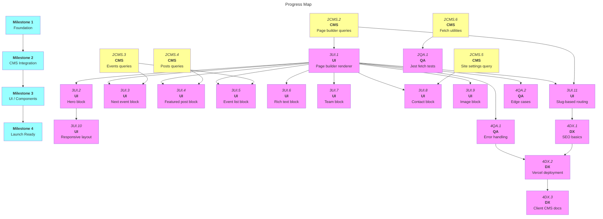

# C58: MVP Roadmap

|          | Status                                          | Next Up                        | Blocked                          |
| -------- | ----------------------------------------------- | ------------------------------ | -------------------------------- |
| **FN**   | ✅ Scaffold, Tailwind, env vars done            | —                              | —                                |
| **CMS**  | ✅ Schema, client config, TS types done         | GROQ queries                   | —                                |
| **UI**   | Not started                                     | Page builder renderer          | Needs GROQ queries               |
| **QA**   | Not started                                     | Jest tests for data fetching   | Needs fetch utilities            |
| **DX**   | ✅ Env vars done                               | —                              | —                                |

---

## Contents

- [Milestones](#milestones)
  - [Milestone 1: Foundation](#m1)
  - [Milestone 2: CMS Integration](#m2)
  - [Milestone 3: UI / Components](#m3)
  - [Milestone 4: Launch Ready](#m4)
- [Progress Map](#map)
- [Out of Scope](#out-of-scope)

---

## Milestones

---

<a name="m1"><h3>Milestone 1: Foundation</h3></a>

> [!IMPORTANT]
> **Goal:** Project scaffold, tooling, Sanity schema, and local dev environment fully working.

<a name="m1-doing"><h4>In Progress (Milestone 1)</h4></a>

<a name="m1-todo"><h4>To Do (Milestone 1)</h4></a>

<a name="m1-blocked"><h4>Blocked (Milestone 1)</h4></a>

<a name="m1-done"><h4>Completed (Milestone 1)</h4></a>

- [x] 1FN.1. Next.js + TypeScript scaffold in /web
- [x] 1FN.2. Tailwind CSS v4 configured
- [x] 1FN.3. Sanity Studio configured in /studio
- [x] 1FN.4. Axios installed
- [x] 1CMS.1. Sanity schema: document types (page, event, post, teamMember, siteSettings)
- [x] 1CMS.2. Sanity schema: page builder block types (hero, nextEvent, featuredPost, eventList, richText, team, contact, image)
- [x] 1CMS.3. Sanity schema: shared objects (bgMedia) + siteSettings singleton wiring
- [x] 1DX.1. Set up environment variables and confirm local dev working (web + studio)

---

<a name="m2"><h3>Milestone 2: CMS Integration</h3></a>

> [!IMPORTANT]
> **Goal:** Sanity data flows into Next.js — client configured, queries written, types defined, fetch utilities tested.

<a name="m2-doing"><h4>In Progress (Milestone 2)</h4></a>

- [ ] 2CMS.2. GROQ queries for page builder content

<a name="m2-todo"><h4>To Do (Milestone 2)</h4></a>

- [ ] 2CMS.3. GROQ queries for events collection
- [ ] 2CMS.4. GROQ queries for posts collection
- [ ] 2CMS.5. GROQ query for site settings singleton
- [ ] 2CMS.6. next-sanity-based data-fetching utilities

<a name="m2-blocked"><h4>Blocked (Milestone 2)</h4></a>

- [ ] 2QA.1. Jest tests for data-fetching logic — **depends on 2CMS.6**

<a name="m2-done"><h4>Completed (Milestone 2)</h4></a>

- [x] 2CMS.1. Sanity client config in /web (project ID, dataset, API version)
- [x] 2CMS.7. TypeScript types/interfaces matching Sanity schema

---

<a name="m3"><h3>Milestone 3: UI / Components</h3></a>

> [!IMPORTANT]
> **Goal:** All page builder blocks rendered as React components, responsive layout, slug-based routing.

<a name="m3-doing"><h4>In Progress (Milestone 3)</h4></a>

<a name="m3-todo"><h4>To Do (Milestone 3)</h4></a>

<a name="m3-blocked"><h4>Blocked (Milestone 3)</h4></a>

- [ ] 3UI.1. Page builder renderer (maps block _type to components) — **depends on 2CMS.2**
- [ ] 3UI.2. Hero block component (bgMedia, overlay text, down arrow) — **depends on 3UI.1**
- [ ] 3UI.3. Next event block component (query-driven, nearest upcoming) — **depends on 3UI.1, 2CMS.3**
- [ ] 3UI.4. Featured post block component — **depends on 3UI.1, 2CMS.4**
- [ ] 3UI.5. Event list block component (upcoming/past toggle) — **depends on 3UI.1, 2CMS.3**
- [ ] 3UI.6. Rich text block component (portable text renderer) — **depends on 3UI.1**
- [ ] 3UI.7. Team block component — **depends on 3UI.1**
- [ ] 3UI.8. Contact block component (pulls from site settings) — **depends on 3UI.1, 2CMS.5**
- [ ] 3UI.9. Image block component — **depends on 3UI.1**
- [ ] 3UI.10. Responsive layout and global styling — **depends on 3UI.2**
- [ ] 3UI.11. Dynamic routing for pages (slug-based) — **depends on 3UI.1, 2CMS.2**

<a name="m3-done"><h4>Completed (Milestone 3)</h4></a>

---

<a name="m4"><h3>Milestone 4: Launch Ready</h3></a>

> [!IMPORTANT]
> **Goal:** Production-quality error handling, SEO, deployment, and client-facing CMS documentation.

<a name="m4-doing"><h4>In Progress (Milestone 4)</h4></a>

<a name="m4-todo"><h4>To Do (Milestone 4)</h4></a>

<a name="m4-blocked"><h4>Blocked (Milestone 4)</h4></a>

- [ ] 4QA.1. Error handling and loading states — **depends on 3UI.1**
- [ ] 4QA.2. Edge cases (empty content, missing images, no events) — **depends on 3UI.1**
- [ ] 4DX.1. SEO basics (meta tags, OG image) — **depends on 3UI.11**
- [ ] 4DX.2. Deployment to Vercel — **depends on 4QA.1, 4DX.1**
- [ ] 4DX.3. Client CMS usage documentation — **depends on 4DX.2**

<a name="m4-done"><h4>Completed (Milestone 4)</h4></a>

---

<a name="map"><h3>Progress Map</h3></a>

---

## Out of Scope (for MVP)

- Authentication / ticketing
- Payment processing
- Email notifications
- Analytics
