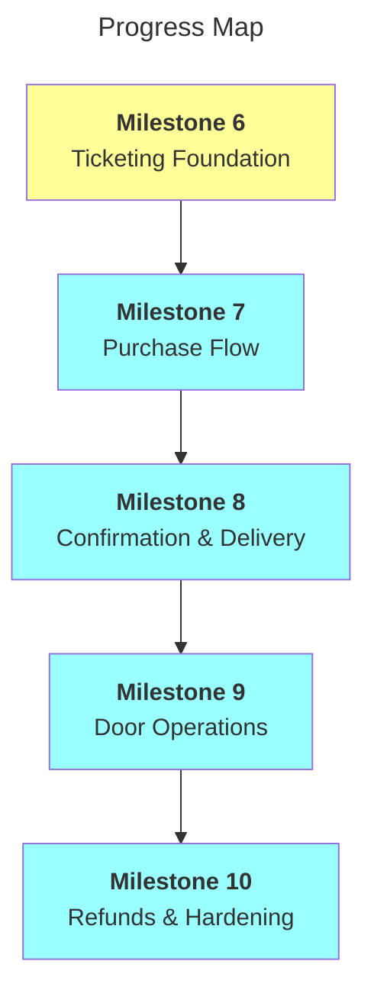

# C58: Ticketing Roadmap

Builds on [MVP Roadmap](mvp.md), which explicitly parked authentication/ticketing, payment processing, email notifications, and the event detail page as out of scope. This roadmap covers that work, per [`sale-architecture.md`](../sale-architecture.md).

Architecture decisions are resolved — see [Decisions](#decisions) — and recorded as [ADR 002](../adrs/002-payment-provider-sumup.md), [ADR 003](../adrs/003-database-supabase.md), and [ADR 004](../adrs/004-event-detail-content-model.md).

|          | Status                                          | Next Up                        | Blocked                          |
| -------- | ------------------------------------------------ | ------------------------------- | --------------------------------- |
| **CMS**  | Milestone 6 complete                               | —                                  | — |
| **DB**   | Not started                                       | Provision Supabase + schema     | — |
| **API**  | Not started                                       | —                                | CMS + DB |
| **UI**   | Not started                                       | —                                | CMS + DB |
| **QA**   | Not started                                       | —                                | — |
| **DX**   | Not started                                       | —                                | — |

---

## Contents

- [Decisions](#decisions)
- [Milestones](#milestones)
  - [Milestone 6: Ticketing Foundation](#m6)
  - [Milestone 7: Purchase Flow](#m7)
  - [Milestone 8: Confirmation & Delivery](#m8)
  - [Milestone 9: Door Operations](#m9)
  - [Milestone 10: Refunds & Hardening](#m10)
- [Progress Map](#map)
- [Out of Scope](#out-of-scope)

---

## Decisions

| # | Decision | ADR |
|---|----------|-----|
| 1 | Payment provider: **SumUp** to start (already used for bar/door; switch to Stripe only if SumUp integration proves insurmountable — considered unlikely) | [ADR 002](../adrs/002-payment-provider-sumup.md) |
| 2 | Database: **Supabase** (mature, generous free tier, prior familiarity) | [ADR 003](../adrs/003-database-supabase.md) |
| 3 | Event detail content model: new **`eventDetails`** document, one-to-one referenced from `event` — carries tiers, `ticketingStatus`, `lineup`, `faq`, and extended body content; `event.ts` untouched, so `EventCard`/`EventListBlock`/`NextEventBlock` are unaffected | [ADR 004](../adrs/004-event-detail-content-model.md) |

---

## Milestones

---

<a name="m6"><h3>Milestone 6: Ticketing Foundation</h3></a>

> [!IMPORTANT]
> **Goal:** `eventDetails` schema and Postgres schema stood up, provider accounts wired to env vars.

<a name="m6-doing"><h4>In Progress (Milestone 6)</h4></a>

<a name="m6-todo"><h4>To Do (Milestone 6)</h4></a>

- [ ] 6DB.1. Provision Supabase project
- [ ] 6DB.2. `orders` table + migration
- [ ] 6DB.3. `order_items` table + migration
- [ ] 6DB.4. `tickets` table + migration (one row per admission, unique `ticket_code`)
- [ ] 6DX.1. Env vars: Supabase connection string, SumUp keys, Brevo API key
- [ ] 6API.1. SumUp sandbox/test account wired up
- [ ] 6DX.2. Note Supabase free-tier inactivity pause in ops docs — calendar reminder or keep-alive once release cadence is known (per [ADR 003](../adrs/003-database-supabase.md))

<a name="m6-blocked"><h4>Blocked (Milestone 6)</h4></a>

<a name="m6-done"><h4>Completed (Milestone 6)</h4></a>

- [x] 6CMS.1. ADR: event detail content model — [ADR 004](../adrs/004-event-detail-content-model.md)
- [x] 6API.2. ADR: payment provider — [ADR 002](../adrs/002-payment-provider-sumup.md)
- [x] 6DB.5. ADR: database — [ADR 003](../adrs/003-database-supabase.md)
- [x] 6CMS.2. Sanity schema: `eventDetails` document — `event` reference (required, unique via hardened draft/published exclusion), `tiers` array (`name`, `price` in pounds — converted to pence once at the fetch boundary in Milestone 7, not stored as pence — `capacity`, `releaseTrigger` for a scheduled date vs. "opens when previous tier sells out", `saleStart`/`saleEnd` with ordering validation, `description`)
- [x] 6CMS.3. Sanity schema: `ticketingStatus` field on `eventDetails` (`not_open` / `on_sale` / `sold_out` / `closed`, manual override, surfaced in the document preview subtitle)
- [x] 6CMS.4. Sanity schema: `lineup` field on `eventDetails` — each entry is either a reference to the existing `talent` roster document or a one-off guest (name + free-text role), plus an optional free-text `setTime`; guests never appear on the general Talent roster page
- [x] 6CMS.5. Sanity schema: `faq` field on `eventDetails` — question/answer objects; answer is restricted portable text (bold + links only, no headings/lists) reusing the existing `portableTextComponents.tsx` renderer, no new frontend work needed
- [x] 6CMS.6. Studio structure: custom "Events" desk item (`structure/event-list.ts`) nests each event's `eventDetails` alongside it via a filtered document list, replacing the flat top-level `eventDetails` list. Deferred: the nested "create" flow doesn't pre-fill the `event` reference — needs a registered initial-value template if that's wanted later

---

<a name="m7"><h3>Milestone 7: Purchase Flow</h3></a>

> [!IMPORTANT]
> **Goal:** Customer can land on the event detail page, pick a tier, and complete a real payment — with capacity correctly locked so two buyers can't take the last spot.

<a name="m7-doing"><h4>In Progress (Milestone 7)</h4></a>

<a name="m7-todo"><h4>To Do (Milestone 7)</h4></a>

- [ ] 7UI.1. Event detail page (`app/events/[slug]/page.tsx`) — replaces current external `ticketUrl` hand-off
- [ ] 7API.1. Remaining-stock computation per tier: Sanity `capacity` minus DB `sold` + `pending` (younger than provider checkout-session window, e.g. SumUp's 30 min). For a `releaseTrigger: 'previousSoldOut'` tier, also gate it open/closed on the *previous* tier's remaining stock hitting zero — Sanity only stores the intent, this is where it actually gets decided
- [ ] 7UI.2. Tier picker UI — quantities, email input, marketing opt-in checkbox (own copy/default, not the provider's)
- [ ] 7API.2. Atomic check-and-reserve — stock check + `orders` insert (`status: pending`) in one DB transaction, so concurrent buyers can't both pass the stock check
- [ ] 7API.3. Checkout session creation (chosen provider), passing `order.id` as reference/metadata for webhook matching
- [ ] 7API.4. Webhook handler — verify payment via API (not redirect alone), mark `orders.status = 'paid'`, generate one `tickets` row per unit with unique `ticket_code`
- [ ] 7QA.1. Concurrency test: two simultaneous purchases against the last tier spot — confirm only one succeeds

<a name="m7-blocked"><h4>Blocked (Milestone 7)</h4></a>

<a name="m7-done"><h4>Completed (Milestone 7)</h4></a>

---

<a name="m8"><h3>Milestone 8: Confirmation & Delivery</h3></a>

> [!IMPORTANT]
> **Goal:** Buyer gets their tickets (QR codes) without the flow depending on instant email delivery, and can check order status without the confirmation email having arrived.

<a name="m8-doing"><h4>In Progress (Milestone 8)</h4></a>

<a name="m8-todo"><h4>To Do (Milestone 8)</h4></a>

- [ ] 8API.1. Brevo transactional email — confirmation send on webhook success
- [ ] 8API.2. QR code generation per ticket (`qrcode`, encodes `ticket_code` only — validation stays server-side)
- [ ] 8UI.1. Confirmation email template — inline/attached QR per ticket for multi-ticket orders
- [ ] 8API.3. Mailing list push (`POST /v3/contacts`) when `marketing_opt_in = true` — non-blocking, log-and-continue on failure, must never fail the webhook
- [ ] 8UI.2. Post-payment screen — "confirmation may take up to 24 hours" messaging
- [ ] 8UI.3. Self-serve order-status page (order ID or email + event lookup)
- [ ] 8DX.1. Brevo quota plan documented — campaigns scheduled days before release, never on release day; note trigger for upgrading to Starter tier

<a name="m8-blocked"><h4>Blocked (Milestone 8)</h4></a>

<a name="m8-done"><h4>Completed (Milestone 8)</h4></a>

---

<a name="m9"><h3>Milestone 9: Door Operations</h3></a>

> [!IMPORTANT]
> **Goal:** Staff can scan a ticket at the door on a phone, a used/voided code is rejected, and a rare connectivity outage degrades gracefully instead of reopening the double-admission risk. Full design: [`qr-code-ticket.md`](../qr-code-ticket.md).

<a name="m9-doing"><h4>In Progress (Milestone 9)</h4></a>

<a name="m9-todo"><h4>To Do (Milestone 9)</h4></a>

- [ ] 9UI.1. Door scanner page (`/scan`) — phone-camera QR reader (e.g. `html5-qrcode`)
- [ ] 9UI.2. Feedback layer — vibrate (`navigator.vibrate`) + full-screen colour flash/tick per scan result
- [ ] 9UI.3. Manual name/email search on `/scan` — same live atomic endpoint as a camera scan, for "no phone/QR" while online
- [ ] 9API.1. Scan endpoint — atomic check-and-flip (`valid` → `used`, stamps `scanned_at`); rejects/flags already-`used` or `voided`
- [ ] 9API.2. Two shared access codes: staff code (any device, live-scan only) and admin code (single dedicated device)
- [ ] 9API.3. Server-side single-admin-session enforcement — a new admin-code login invalidates/rejects any other concurrent admin session
- [ ] 9UI.4. Admin-device offline mode — continuously-synced local cache; on connection loss, local flip + queue instead of a live call. Regular devices instead hard-stop with "NO CONNECTION — hand off to admin device" (no local write path on those at all)
- [ ] 9API.4. Reconnect sequencing — admin device drains its queue to the server in order; regular devices refresh their local cache from the server before resuming live scanning
- [ ] 9DX.1. Staff training note: admin code lives on one dedicated device handed to whoever runs the door that night, not a personal phone

<a name="m9-blocked"><h4>Blocked (Milestone 9)</h4></a>

<a name="m9-done"><h4>Completed (Milestone 9)</h4></a>

---

<a name="m10"><h3>Milestone 10: Refunds & Hardening</h3></a>

> [!IMPORTANT]
> **Goal:** Full-order refunds work end-to-end (v1 — no partial refunds), and the whole flow is documented for client handover.

<a name="m10-doing"><h4>In Progress (Milestone 10)</h4></a>

<a name="m10-todo"><h4>To Do (Milestone 10)</h4></a>

- [ ] 10API.1. Refund trigger (admin view or direct action) — full order only
- [ ] 10API.2. Void every `tickets` row on the order (`status = 'voided'`), rejected at scanner same as `used`
- [ ] 10API.3. Provider refund API call for full `amount_total`, mark `orders.status = 'refunded'`
- [ ] 10DX.1. Client-facing ticketing ops documentation (mirrors CMS guide pattern from MVP roadmap) — refund flow, door scanning, reading order status

<a name="m10-blocked"><h4>Blocked (Milestone 10)</h4></a>

<a name="m10-done"><h4>Completed (Milestone 10)</h4></a>

---

<a name="map"><h3>Progress Map</h3></a>

---

## Out of Scope (for this roadmap)

- Partial refunds (deliberately deferred — see Milestone 10 rationale in `sale-architecture.md`)
- Ticket transfers / name changes between buyers
- Waitlists for sold-out tiers
- Analytics / sales reporting dashboards
