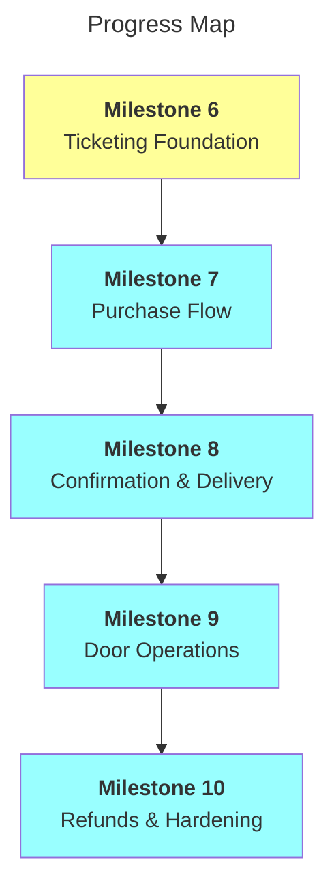

# C58: Ticketing Roadmap

Builds on [MVP Roadmap](mvp.md), which explicitly parked authentication/ticketing, payment processing, email notifications, and the event detail page as out of scope. This roadmap covers that work, per [`sale-architecture.md`](../sale-architecture.md).

Architecture decisions are resolved — see [Decisions](#decisions) — and recorded as [ADR 002](../adrs/002-payment-provider-sumup.md), [ADR 003](../adrs/003-database-supabase.md), and [ADR 004](../adrs/004-event-detail-content-model.md).

|          | Status                                          | Next Up                        | Blocked                          |
| -------- | ------------------------------------------------ | ------------------------------- | --------------------------------- |
| **CMS**  | Milestone 6 complete                               | —                                  | — |
| **DB**   | `tiers` table + nullable `provider_session_id` migrations pushed to live Supabase | — | — |
| **API**  | 7API.1–7API.4 complete, real Milestone 7 flow end-to-end in code | 7QA.1 (concurrency test); real sandbox payment not yet run in-browser | — |
| **UI**   | 7UI.1/7UI.2 complete, reservation redirects to SumUp checkout | Confirmation screen needs 8UI.2/8UI.3 | — |
| **QA**   | Not started                                       | —                                | — |
| **DX**   | Not started                                       | —                                | — |

---

## Contents

- [Decisions](#decisions)
- [Milestones](#milestones)
  - [Milestone 6: Ticketing Foundation](#m6)
  - [Milestone 7: Purchase Flow](#m7)
  - [Milestone 8: Confirmation & Delivery](#m8)
  - [Milestone 9: Door Operations](#m9)
  - [Milestone 10: Refunds & Hardening](#m10)
- [Progress Map](#map)
- [Out of Scope](#out-of-scope)

---

## Decisions

| # | Decision | ADR |
|---|----------|-----|
| 1 | Payment provider: **SumUp** to start (already used for bar/door; switch to Stripe only if SumUp integration proves insurmountable — considered unlikely) | [ADR 002](../adrs/002-payment-provider-sumup.md) |
| 2 | Database: **Supabase** (mature, generous free tier, prior familiarity) | [ADR 003](../adrs/003-database-supabase.md) |
| 3 | Event detail content model: new **`eventDetails`** document, one-to-one referenced from `event` — carries tiers, `ticketingStatus`, `lineup`, `faq`, and extended body content; `event.ts` untouched, so `EventCard`/`EventListBlock`/`NextEventBlock` are unaffected | [ADR 004](../adrs/004-event-detail-content-model.md) |

---

## Milestones

---

<a name="m6"><h3>Milestone 6: Ticketing Foundation</h3></a>

> [!IMPORTANT]
> **Goal:** `eventDetails` schema and Postgres schema stood up, provider accounts wired to env vars.

<a name="m6-doing"><h4>In Progress (Milestone 6)</h4></a>

<a name="m6-todo"><h4>To Do (Milestone 6)</h4></a>

- [ ] 6DX.1. Env vars: Brevo API key (Supabase and SumUp done, see completed items)

<a name="m6-blocked"><h4>Blocked (Milestone 6)</h4></a>

<a name="m6-done"><h4>Completed (Milestone 6)</h4></a>

- [x] 6CMS.1. ADR: event detail content model — [ADR 004](../adrs/004-event-detail-content-model.md)
- [x] 6API.2. ADR: payment provider — [ADR 002](../adrs/002-payment-provider-sumup.md)
- [x] 6DB.5. ADR: database — [ADR 003](../adrs/003-database-supabase.md)
- [x] 6DB.1. Provision Supabase project — created, linked locally via `supabase init`/`supabase link`; pooled connection string in `web/.env.local` as `DATABASE_POOLED_URL` (no `NEXT_PUBLIC_` prefix — server-only)
- [x] 6DB.2. `orders` table + migration — `event_id` points at the Sanity `eventDetails` document (tiers/capacity live there post-ADR 004, not on `event`); `provider_session_id` unique for webhook idempotency; `status` check-constrained; indexes for the capacity-check query and the Milestone 8 email lookup
- [x] 6DB.3. `order_items` table + migration — joins tiers via Sanity's stable `tiers[]._key`, not `tier_name` (a Studio rename shouldn't break past orders' stock accounting); `tier_name`/`unit_price` kept as purchase-time snapshots
- [x] 6DB.4. `tickets` table + migration (one row per admission, unique `ticket_code`, `status` check-constrained to match the door-scanner's atomic check-and-flip design)
  - All three migrations applied in order against a throwaway local Postgres container and negative-tested (bad status values, `quantity <= 0`, duplicate `provider_session_id` all correctly rejected), then pushed to the live Supabase project via `supabase db push` and confirmed in sync with `supabase migration list`.
- [x] 6DB.6. RLS enabled on all three tables (via dashboard, then captured as a migration — no policies; denies all access to every non-owner role, a fail-safe if Data API is ever turned on before policies exist. Confirmed to have no effect on the app's own access, which connects as the owner role regardless)
- [x] 6DX.2. Supabase keepalive — `.github/workflows/supabase-keepalive.yml` pings `DATABASE_POOLED_URL` twice weekly (Mon/Thu) via `psql`, well under the ~1 week free-tier inactivity pause; needs a `DATABASE_POOLED_URL` repo secret added before it can run
- [x] 6CMS.2. Sanity schema: `eventDetails` document — `event` reference (required, unique via hardened draft/published exclusion), `tiers` array (`name`, `price` in pounds — converted to pence once at the fetch boundary in Milestone 7, not stored as pence — `capacity`, `releaseTrigger` for a scheduled date vs. "opens when previous tier sells out", `saleStart`/`saleEnd` with ordering validation, `description`)
- [x] 6CMS.3. Sanity schema: `ticketingStatus` field on `eventDetails` (`not_open` / `on_sale` / `sold_out` / `closed`, manual override, surfaced in the document preview subtitle)
- [x] 6CMS.4. Sanity schema: `lineup` field on `eventDetails` — each entry is either a reference to the existing `talent` roster document or a one-off guest (name + free-text role), plus an optional free-text `setTime`; guests never appear on the general Talent roster page
- [x] 6CMS.5. Sanity schema: `faq` field on `eventDetails` — question/answer objects; answer is restricted portable text (bold + links only, no headings/lists) reusing the existing `portableTextComponents.tsx` renderer, no new frontend work needed
- [x] 6CMS.6. Studio structure: custom "Events" desk item (`structure/event-list.ts`) nests each event's `eventDetails` alongside it via a filtered document list, replacing the flat top-level `eventDetails` list. Deferred: the nested "create" flow doesn't pre-fill the `event` reference — needs a registered initial-value template if that's wanted later
- [x] 6API.1. SumUp sandbox account + API key — static Bearer API key (`SUMUP_API_KEY`) generated against the sandbox merchant, not the "SumUp Public Key" shown alongside it on the same dashboard page (SumUp's own docs: "do not use the public key in your integration" — its actual purpose is undocumented, and nothing in the hosted-checkout flow consumes it). OAuth 2.0 considered and ruled out — it's for third-party apps a merchant explicitly authorizes, not a fit for a single self-owned integration. Known open item, not blocking sandbox work: a dashboard API key is all-or-nothing full-account access with no scope restriction, which matters once this points at the live merchant account shared with a sister business — revisit before go-live (options: SumUp support for a split sub-account, or OAuth's manually-verified `payments`-only scope)

---

<a name="m7"><h3>Milestone 7: Purchase Flow</h3></a>

> [!IMPORTANT]
> **Goal:** Customer can land on the event detail page, pick a tier, and complete a real payment — with capacity correctly locked so two buyers can't take the last spot.

<a name="m7-doing"><h4>In Progress (Milestone 7)</h4></a>

<a name="m7-todo"><h4>To Do (Milestone 7)</h4></a>

- [ ] 7QA.1. Concurrency test: two simultaneous purchases against the last tier spot — confirm only one succeeds

<a name="m7-blocked"><h4>Blocked (Milestone 7)</h4></a>

<a name="m7-done"><h4>Completed (Milestone 7)</h4></a>

- [x] 7UI.1. Event detail page (`app/events/[slug]/page.tsx`) — canonical destination for every event now, replacing the external `ticketUrl` hand-off. Falls back to `ticketUrl` as an external button when an event has no `eventDetails` yet (nothing regresses during migration); lists tiers/lineup/FAQ when it does. `EventCard`'s CTA now always links internally. Verified with a real `next build` against the live dataset (all 3 existing events, none with `eventDetails` yet, so only the fallback path has been exercised against real content so far)
- [x] 7UI.2. Tier picker (`TierPicker.tsx`) — quantities (capped at `min(capacity, 10)`, placeholder pending `7API.1`'s live stock), email, marketing opt-in (default unchecked, own copy). Wired to a new stubbed server action (`actions.ts`, Zod-validated, first use of Zod in `web/`) that returns "not available yet" — `7API.2`/`7API.3` fill in the real logic later without the UI changing. 10 new tests
- [x] 7API.1. Remaining-stock computation — first runtime Postgres connection in `web/` (`postgres` npm package, `DATABASE_POOLED_URL`). Originally an `orders`/`order_items` aggregate (`lib/getOrderCounts.ts`); revised alongside `7API.2` once capacity/reserved moved into Postgres directly (`tiers` table) — now `lib/getTierAvailability.ts`, a plain read of the mirror, no joins or time-window filtering. `lib/stock.ts`'s pure `computeRemainingStock` (capacity minus reserved, `previousSoldOut` gating on the previous tier hitting zero) is shared by both display and enforcement, so they can't disagree. Served via a dynamic route (`app/api/stock/[eventDetailsId]`, `Cache-Control: no-store`, sweeps stale reservations before reading — see `7API.2`) fetched client-side by `TierPicker` on mount — `/events/[slug]` itself stays static (route renders `ƒ`, event pages stay `●`). `TierPicker` shows "Checking availability…" while loading, falls back to the capacity/order-max cap on fetch failure rather than blocking
- [x] 7API.2. Atomic check-and-reserve — capacity mirrored into Postgres (`tiers` table) via a new Sanity webhook (`app/api/webhooks/sanity-tiers`, signature-verified via `@sanity/webhook`), so a plain conditional `UPDATE ... WHERE capacity - reserved >= $qty` is the entire concurrency primitive — Postgres's own row-level locking on that statement, not advisory locks (the originally-planned approach, superseded during review). `lib/reserveOrder.ts`: one transaction, sweep → re-check `previousSoldOut` gating → atomic per-tier increment (sorted `tier_key` order, avoids deadlocking with concurrent multi-tier orders) → insert `orders`/`order_items` (pence conversion happens here — first real use of the Milestone 6 fetch-boundary decision). `lib/sweepStaleReservations.ts` shared between reservation and the `7API.1` read path — sweeping only on write is a self-locking trap (a tier stuck at "sold out" from abandoned carts alone could never be corrected, since the only thing that triggers a sweep is a reservation attempt, and the UI disables the button that would start one once remaining hits 0). `createOrder` wired live — real `pending` orders now get created from real usage; still nowhere to actually pay until `7API.3`. Verified via ad-hoc testing against a throwaway Postgres container (concurrency, atomic multi-tier rollback, sweep-via-read, gating, webhook signature/upsert/removal), not committed as a live-DB-dependent Jest suite — no existing test in this project needs one to pass. Live: webhook configured in Sanity's dashboard (filtered to published documents only, excluding drafts) and `SANITY_WEBHOOK_SECRET` set in both `web/.env.local` and the deployed environment
- [x] 7API.2b. Whole-`eventDetails`-document deletion in the `sanity-tiers` webhook — Sanity's `Delete` trigger also fires on unpublish, and the projection can't be trusted (no current document to read `tiers[]` from), so this branch reads `sanity-operation`/`sanity-document-id` headers instead of the parsed body, then runs the same "pin every tier's `capacity` down to its `reserved` count" treatment already used for an in-array tier removal — no literal row deletion, `order_items` snapshots untouched. Verified via ad-hoc Postgres-container test (pins the target event only, leaves others untouched, 400s a delete with no document-id header, still 401s a bad signature). Deliberately no automated refund/cancellation handling for reserved tickets on a deleted future event — refunds are still an unbuilt Milestone 10 concern, so there's nothing to hook into yet; `orders.email` stays queryable for manual outreach in the meantime. Still needs live confirmation that the dashboard's `_type == "eventDetails"` filter actually matches on a real delete event (undocumented; deleting a real test document once the Delete trigger is enabled will confirm)
- [x] 7API.3. Checkout session creation — `lib/sumup.ts` (`POST /v0.1/checkouts`, Bearer auth, `hosted_checkout: {enabled: true}`), called from `actions.ts` after `reserveOrder` returns `reserved`, outside `reserveOrder`'s own transaction — same "no external call inside a DB transaction" precedent as the Sanity fetch already in `actions.ts`. `checkout_reference` is `order.id`; `amount` converts pence back to a pounds decimal (`toFixed(2)` reparsed, avoiding float noise in the JSON body) — the reverse of the Milestone 6 fetch-boundary conversion. `redirect_url` deliberately omitted (optional per SumUp; no confirmation page exists until 8UI.2/8UI.3, so nothing to send the customer back to yet); `return_url` points at `/api/webhooks/sumup`, which doesn't exist until `7API.4` — SumUp's own retry policy (four attempts over ~2h27m) covers the gap until then. `reserveOrder.ts`'s `ReserveResult` now carries `amountTotal` through (already computed pre-transaction). New `lib/failReservation.ts` releases the seat immediately if checkout-session creation fails after a successful reservation, rather than making the buyer wait out the 30-min sweep — atomically claims the order via the same conditional-`UPDATE`-`WHERE status = 'pending'` idiom as `reserveOrder`'s own increment, so it can't double-release if it somehow raced the sweep. `redirect()` (Next.js) called outside the try/catch around the SumUp call, since it throws internally — catching it there would silently swallow the navigation. Verified: a real checkout created against the live SumUp sandbox (`hosted_checkout_url` returned), `failReservation` ad-hoc-tested against a throwaway Postgres container (releases stock + marks failed, idempotent on a second call, no-ops on an unknown order id), full `tsc`/lint/Jest/`next build`. SumUp auth researched properly (not from memory) — static API key, not the adjacent "public key" (explicitly wrong per SumUp's docs) and not OAuth (built for third-party consent, not a single self-owned merchant). Known gap: the sandbox API key has full account access with no scope restriction — fine for sandbox, needs resolving before the live merchant account (shared with a sister business) is used, see `6API.1`
- [x] 7API.4. Payment webhook — `app/api/webhooks/sumup/route.ts`, POST target of the `return_url` set in `7API.3`. SumUp sends no signature and the payload (`{event_type, id}`) carries no status — it's a "go check" nudge, not a claim, so every consequential action is gated on a fresh `getCheckoutStatus(id)` (new in `lib/sumup.ts`, `GET /v0.1/checkouts/{id}`) using our own API key, never the POST body. The incoming `id` matches one of our orders via `provider_session_id` (written there by `7API.3`'s `attachCheckoutSession`). `PAID` → one transaction: atomically claims the order (`UPDATE ... WHERE status = 'pending'`, same idiom as `reserveOrder`/`failReservation`) then inserts one `tickets` row per unit — `order_items.quantity`-many per line, not one per line — each via new `lib/generateTicketCode.ts` (`C58-XXXXXXXX`, plain hex; first committed Jest test in this batch, since it's pure and DB-free). Claim and ticket inserts share the transaction, so an (astronomically unlikely) `ticket_code` collision rolls the claim back too, leaving the order `pending` for a clean retry rather than stuck "paid, no tickets." `tiers.reserved` untouched on `PAID` — already counted at reservation time, exactly the note already sitting in `reserveOrder.ts`. `FAILED`/`EXPIRED` → reuses `failReservation` as-is, no new release logic needed. An initial `orders.status !== 'pending'` check is a fast-path only (skips an unnecessary SumUp round-trip on a duplicate delivery) — the actual idempotency guard is the atomic claim itself, verified directly (a second `PAID` delivery for the same order is a no-op, confirmed zero extra `getCheckoutStatus` calls and no duplicate tickets). `createCheckoutSession` also gained `valid_until`, deliberately **25 minutes**, shorter than the 30-minute sweep window — the sweep is lazy (never fires early, but can fire arbitrarily late, since it only runs on the next read/write) while a payment accepted right at a shared 30-minute boundary could still be settling when the sweep releases the same seat; the 5-minute margin guarantees SumUp has closed the checkout before the sweep is even eligible to touch it. Confirmed live against the sandbox: `valid_until` round-trips correctly (`date` + exactly 25 minutes, not silently dropped). Verified: DB-side logic (claim, quantity fan-out across multiple line items, idempotency, `FAILED` release) ad-hoc-tested against a throwaway Postgres container with `getCheckoutStatus` mocked; full `tsc`/lint/Jest/`next build`. Not yet verified: a real end-to-end run (genuinely paying a sandbox checkout via a SumUp test card in-browser, confirming the live webhook actually reaches this route) — needs a browser, can't be scripted

---

<a name="m8"><h3>Milestone 8: Confirmation & Delivery</h3></a>

> [!IMPORTANT]
> **Goal:** Buyer gets their tickets (QR codes) without the flow depending on instant email delivery, and can check order status without the confirmation email having arrived.

<a name="m8-doing"><h4>In Progress (Milestone 8)</h4></a>

<a name="m8-todo"><h4>To Do (Milestone 8)</h4></a>

- [ ] 8API.1. Brevo transactional email — confirmation send on webhook success
- [ ] 8API.2. QR code generation per ticket (`qrcode`, encodes `ticket_code` only — validation stays server-side)
- [ ] 8UI.1. Confirmation email template — inline/attached QR per ticket for multi-ticket orders
- [ ] 8API.3. Mailing list push (`POST /v3/contacts`) when `marketing_opt_in = true` — non-blocking, log-and-continue on failure, must never fail the webhook
- [ ] 8UI.2. Post-payment screen — "confirmation may take up to 24 hours" messaging
- [ ] 8UI.3. Self-serve order-status page (order ID or email + event lookup)
- [ ] 8DX.1. Brevo quota plan documented — campaigns scheduled days before release, never on release day; note trigger for upgrading to Starter tier

<a name="m8-blocked"><h4>Blocked (Milestone 8)</h4></a>

<a name="m8-done"><h4>Completed (Milestone 8)</h4></a>

---

<a name="m9"><h3>Milestone 9: Door Operations</h3></a>

> [!IMPORTANT]
> **Goal:** Staff can scan a ticket at the door on a phone, a used/voided code is rejected, and a rare connectivity outage degrades gracefully instead of reopening the double-admission risk. Full design: [`qr-code-ticket.md`](../qr-code-ticket.md).

<a name="m9-doing"><h4>In Progress (Milestone 9)</h4></a>

<a name="m9-todo"><h4>To Do (Milestone 9)</h4></a>

- [ ] 9UI.1. Door scanner page (`/scan`) — phone-camera QR reader (e.g. `html5-qrcode`)
- [ ] 9UI.2. Feedback layer — vibrate (`navigator.vibrate`) + full-screen colour flash/tick per scan result
- [ ] 9UI.3. Manual name/email search on `/scan` — same live atomic endpoint as a camera scan, for "no phone/QR" while online
- [ ] 9API.1. Scan endpoint — atomic check-and-flip (`valid` → `used`, stamps `scanned_at`); rejects/flags already-`used` or `voided`
- [ ] 9API.2. Two shared access codes: staff code (any device, live-scan only) and admin code (single dedicated device)
- [ ] 9API.3. Server-side single-admin-session enforcement — a new admin-code login invalidates/rejects any other concurrent admin session
- [ ] 9UI.4. Admin-device offline mode — continuously-synced local cache; on connection loss, local flip + queue instead of a live call. Regular devices instead hard-stop with "NO CONNECTION — hand off to admin device" (no local write path on those at all)
- [ ] 9API.4. Reconnect sequencing — admin device drains its queue to the server in order; regular devices refresh their local cache from the server before resuming live scanning
- [ ] 9DX.1. Staff training note: admin code lives on one dedicated device handed to whoever runs the door that night, not a personal phone

<a name="m9-blocked"><h4>Blocked (Milestone 9)</h4></a>

<a name="m9-done"><h4>Completed (Milestone 9)</h4></a>

---

<a name="m10"><h3>Milestone 10: Refunds & Hardening</h3></a>

> [!IMPORTANT]
> **Goal:** Full-order refunds work end-to-end (v1 — no partial refunds), and the whole flow is documented for client handover.

<a name="m10-doing"><h4>In Progress (Milestone 10)</h4></a>

<a name="m10-todo"><h4>To Do (Milestone 10)</h4></a>

- [ ] 10API.1. Refund trigger (admin view or direct action) — full order only
- [ ] 10API.2. Void every `tickets` row on the order (`status = 'voided'`), rejected at scanner same as `used`
- [ ] 10API.3. Provider refund API call for full `amount_total`, mark `orders.status = 'refunded'`
- [ ] 10DX.1. Client-facing ticketing ops documentation (mirrors CMS guide pattern from MVP roadmap) — refund flow, door scanning, reading order status

<a name="m10-blocked"><h4>Blocked (Milestone 10)</h4></a>

<a name="m10-done"><h4>Completed (Milestone 10)</h4></a>

---

<a name="map"><h3>Progress Map</h3></a>

```mermaid
---
title: Progress Map
---
graph TD

m6["`**Milestone 6**<br/>Ticketing Foundation`"]:::mile
m7["`**Milestone 7**<br/>Purchase Flow`"]:::mile
m8["`**Milestone 8**<br/>Confirmation & Delivery`"]:::mile
m9["`**Milestone 9**<br/>Door Operations`"]:::mile
m10["`**Milestone 10**<br/>Refunds & Hardening`"]:::mile

m6 --> m7 --> m8 --> m9 --> m10

class m6 open

classDef default fill:#f9f
classDef open fill:#ff9
classDef mile fill:#9ff
```

---

## Out of Scope (for this roadmap)

- Partial refunds (deliberately deferred — see Milestone 10 rationale in `sale-architecture.md`)
- Ticket transfers / name changes between buyers
- Waitlists for sold-out tiers
- Analytics / sales reporting dashboards
